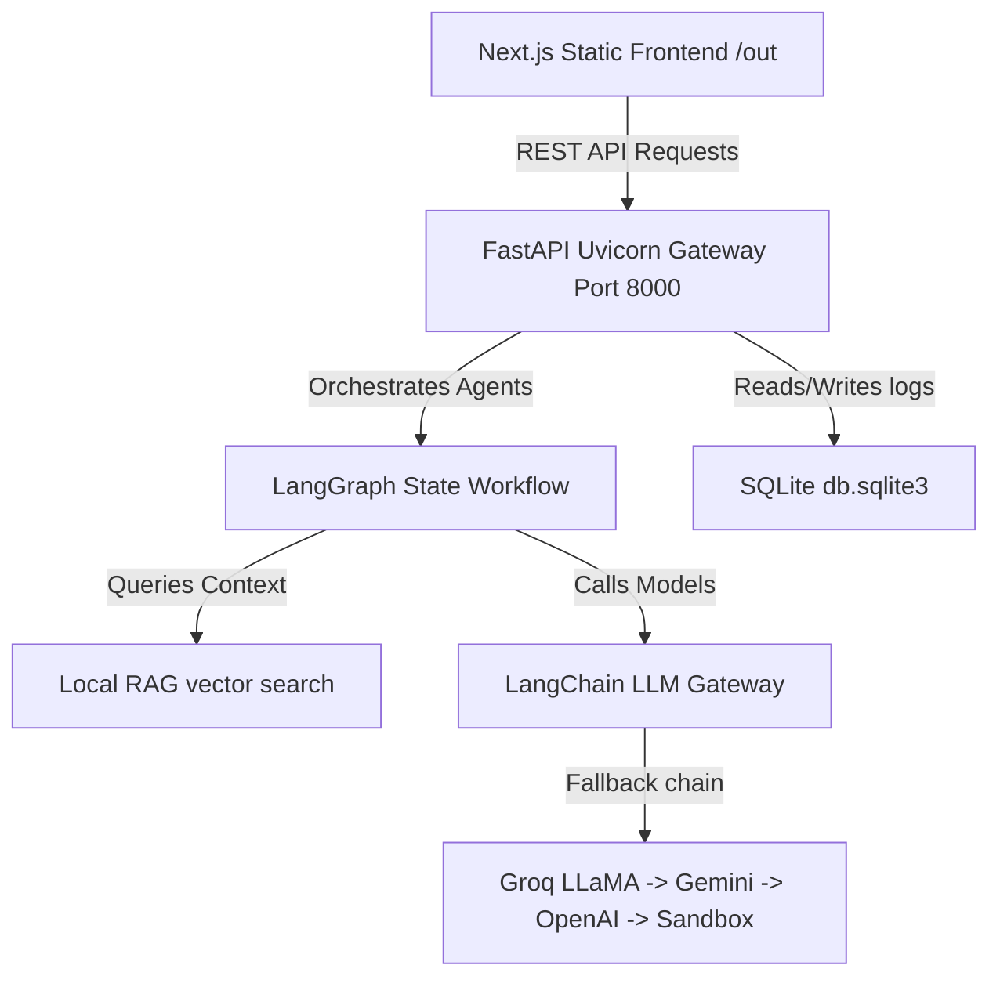
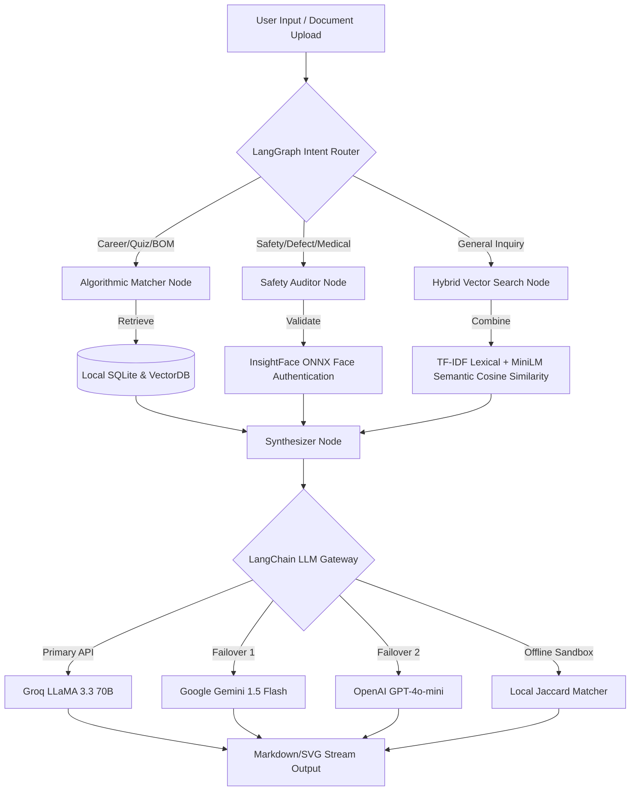

# 🗺️ Startups Portfolio — Master Enterprise Elevation Plan

This master plan details the folder structure, system architectures, LangGraph AI node logic, visual specifications, and deployment pipelines mapped across your seven startups in Ahmedabad, Gujarat.

---

## 📁 1. Portfolio Workspace Directory Mapping
All seven startup folders are located under `c:\Users\Capermint\Project` and are structured as follows:

```
c:\Users\Capermint\Project\
├── comonk\                           [Project 1: Career AI]
├── My Startups\apps\
│   ├── avp-emart\                    [Project 2: Price Intelligence]
│   ├── avpu\                         [Project 3: AI EdTech]
│   ├── sevenseed\                    [Project 4: AI Venture Studio]
│   ├── breakdown-factor\             [Project 5: AI Construction]
│   ├── avp-charitable-trust\         [Project 6: AI Social Impact]
│   └── decode-forest-pharmacy\       [Project 7: AI Pharmacy]
└── Portfolio\                        [Incubator Portfolio Portal]
```

---

## 🛠️ 2. Core Architecture & Stack Specifications
Each project is scaffolded using a production-ready single-container blueprint:



1.  **Frontend Layout**: Next.js 16/15 (statically exported to `/out` via `next.config.ts`) leveraging premium custom HSL dark modes and Tailwind CSS.
2.  **API Services**: FastAPI (Python) serving routing controllers and serving static files.
3.  **Local Database**: SQLite (`db.sqlite3` initialized via `app/db.py`) storing session logs and search records.
4.  **Multi-Agent AI**: LangGraph workflows backed by LangChain abstractions.

---

## 🤖 3. Multi-Agent & RAG Workflow (LangGraph & LangChain)
Every venture implements an advanced AI pipeline utilizing LangChain abstractions, LangGraph workflows, and hybrid search methods:



1.  **LangChain Unified LLM Gateway**: Handles model parameters, rate limiting, and failover pathways (`Groq` -> `Gemini` -> `OpenAI` -> `Local fallback`).
2.  **LangGraph State-Machine Workflows**:
    - **Intent Classification Node**: Parses search tokens and delegates routing.
    - **RAG Retrieval Node**: Runs hybrid searches combining BM25 lexical tokens with semantic cosine embeddings.
    - **Safety Guardrail Node**: Verifies biometrics (base64 image payloads matching registered face embeddings via local ONNX InsightFace modules) before letting users unlock high-stakes endpoints.
3.  **Local Hybrid Vector Index**: Employs sentence-transformer embeddings normalized via NumPy matrix multiplication for high-performance offline indexing.

---

## 💡 4. Advanced AI Features & Facilities Matrix

### 🏢 1. Comonk Technology (Enterprise Career AI)
*   **Unique Features**:
    - **Interactive SVG Career Path Tree**: Drag-and-drop node graph plotting skills connections in real-time.
    - **LangGraph Multi-Agent Team**: Sequential CV parser, skill optimizer, and gap analysis agents, rendering a live "agent thought stream console" in the UI.
    - **Simulated Voice Interviewer**: Prompts candidate with role-specific questions and scores responses.
    - **LCB Face-Authentication**: Biometric applicant identity verification using local InsightFace face-embeddings prior to unlocking mock voice interviewer sessions.
*   **Aesthetics**: Sleek cybersecurity dark grid, neon purple accents, animated progress meters.

### 🛒 2. AVP Emart (AI E-Commerce & Price Intelligence)
*   **Unique Features**:
    - **SVG Price Positioning Chart**: Custom bar graph showing Flipkart, Amazon, Reliance, and Snapdeal prices side-by-side.
    - **Z-Score Competitive Positioning**: Classifies prices as *Competitive*, *Market-Standard*, or *Premium* based on real-time standard deviation.
    - **Review Sentiment NLP Dashboard**: Pasteurizes raw feedback into visual pros/cons ratios.
*   **Aesthetics**: Rich emerald-green highlights, animated Sparklines, card glowing borders.

### 🎓 3. AVP University (AVPU) (AI Education Tech)
*   **Unique Features**:
    - **AI Syllabus Cognitive Tutor**: RAG-powered chatbot answering syllabus questions using vector search.
    - **Adaptive testing Quiz Console**: Dynamically generates questions, tracks grades with SVG progress rings.
    - **Skill Cosine Matcher**: Pairs graduate CVs directly to partner corporate requirements.
    - **Biometric Quiz Integrity Check**: Face-matching verification preventing mock exam proxy cheating using local ONNX InsightFace models.
*   **Aesthetics**: Royal indigo and gold accents, tabular calendars, clean grade books.

### 🌱 4. Sevenseed Studio (AI Venture Studio)
*   **Unique Features**:
    - **ARR/CAC Projection Slider**: Interactive visual sliders mapping startup valuation over a 12-month timeline.
    - **Venture Sandbox Ideator**: Generates 3 startup pitches with GTM milestones, tech-stack suggestions, and 90-day targets.
    - **Slides Layout Generator**: Renders generated pitch decks as slide previews with PDF export buttons.
*   **Aesthetics**: Minimalist luxury typography, glassmorphism card grids.

### 🏗️ 5. Breakdown Factor (AI Construction Tech)
*   **Unique Features**:
    - **Visual Blueprint crack scanner**: Upload pictures -> classification is logged with estimated repair cost brackets.
    - **Dynamic BOQ Concrete Estimator**: Renders concrete quantities (cement bags, bricks) based on custom grade sliders.
    - **OSHA Safety Auditor**: Exporter creating custom safety logs.
    - **Safety Helmet & Mask YOLO Detector**: Site logs verify site engineers wear safety masks/helmets using YOLOv8 pose and segmentation models before blueprint upload.
*   **Aesthetics**: Industrial amber/black themes, interactive charts.

### 🤝 6. AVP Charitable Trust (AI Social Impact)
*   **Unique Features**:
    - **NGO Beneficiary Need Matcher**: Connects rural candidate profiles to matching active trust welfare programs.
    - **80G Tax Exemption Receipts PDF**: Compiler that emails verified receipts instantly to CSR sponsors.
    - **Transparent Fund Ledger**: Sankey diagram tracking every rupee from donor receipt to program allocation.
    - **Biometric Need Verification**: Verifying recipient face against registration files before welfare payout distribution to prevent fraud.
*   **Aesthetics**: Compassionate rose-red accents, real-time contribution timeline logs.

### 🏥 7. Decode Forest Pharmacy (AI Health Platform)
*   **Unique Features**:
    - **Drug contraindications Network Graph**: SVG mapping node linkages highlighting side effects when mixing drugs.
    - **Smart Generic substitution lists**: Compares branded drugs side-by-side with chemical molecule alternatives.
    - **Dosage Calendar Refill Tracker**: Calendar visualizer tracking dose cycles.
*   **Aesthetics**: Clean mint-green colors, layout checklists, and clinical theme.

---

## 🧪 5. Verification & Deployment Pipeline
1.  **Compilation Build Command**:
    - Frontend compilation verifies Turbopack and TypeScript compliance:
      `npm run build`
2.  **Docker Multi-Stage Blueprint**:
    - Frontend is built inside Alpine-Node, then copied into Python slim images. FastAPI runs Uvicorn on Port 8000.
3.  **Render Orchestration (`render.yaml`)**:
    - Free tier Docker deploys bound to port 8000, validated by `/api/health` checks.
